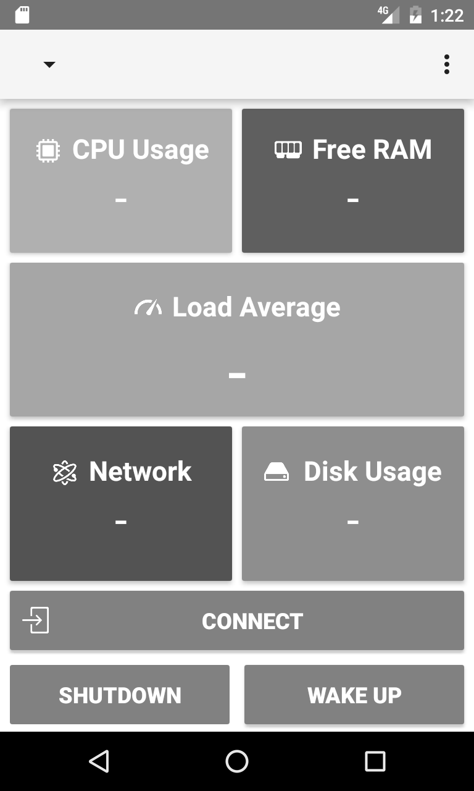

JuiceSSH Plugin: Performance Monitor
===========================

A JuiceSSH plugin for monitoring FreeNAS servers using the JuiceSSH Plugin SDK.

This plugin will connect to your choice of JuiceSSH connection and execute commands to monitor the
performance of the FreeNAS server.

The app also provide Wake on Lan feature and a shutdown button.

ABOUT:

This JuiceSSH plugin monitors performance statistics on FreeNAS based systems.

It works by starting a background JuiceSSH session and running various commands on a periodic basis
to obtain the metrics required.

In order to use the wake on lan functionality you must provide  the correct values on the
Menu->Settings. For the shutdown functionality the ssh user must be in operator group.

Currently this plugin has been tested with FreeNAS 9, however this plugin is open source and
freely available on Github.

  Please take a look at the github page.
          https://github.com/bpvelloso/freenasmonitor

  This project was based on JuiceSSH Performance Monitor Plugin:
          https://github.com/sonelli/juicessh-performancemonitor.

Thank you,
bpv.dev@gmail.com